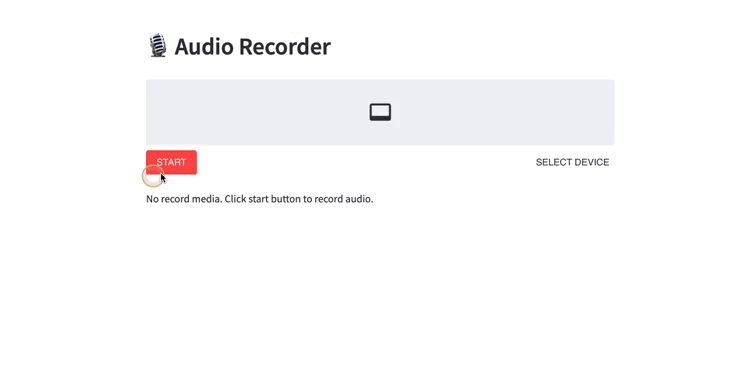

[Demo](https://share.streamlit.io/1010code/streamlit-audio-recorder/main/app.py)




## Getting Started
### Clone Project
you can create a new project based on `streamlit-audio-recorder` by doing the following:

```bash
git clone https://github.com/1010code/streamlit-audio-recorder.git
cd streamlit-audio-recorder
```

### Installation
When that's done, install the project dependencies.

```bash
pip install -r requirements.txt
```

### Running the Project
After completing the installation step, you're ready to start the project.

`streamlit run app.py` running locally!

## Contribute
### Report Issues and Improvement Suggestions
File report at this project's [issue](https://github.com/1010code/streamlit-audio-recorder/issues) tracker if you noticed some problem or have improvement suggestions.
### Contribute to This Project
Create your [fork](https://github.com/1010code/streamlit-audio-recorder/fork) repository, create and switch to a new Git branch, do your edits and commit as a new version, push them to your remote repository on GitHub and file us a [pull request](https://github.com/1010code/streamlit-audio-recorder/pulls) !
